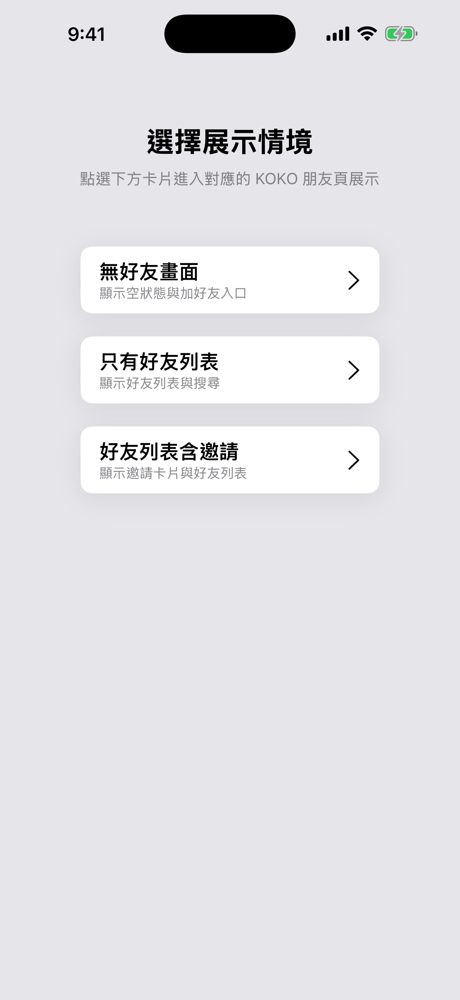
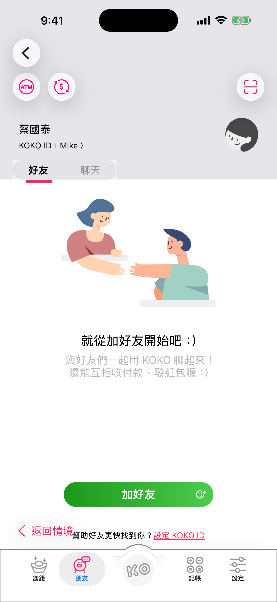
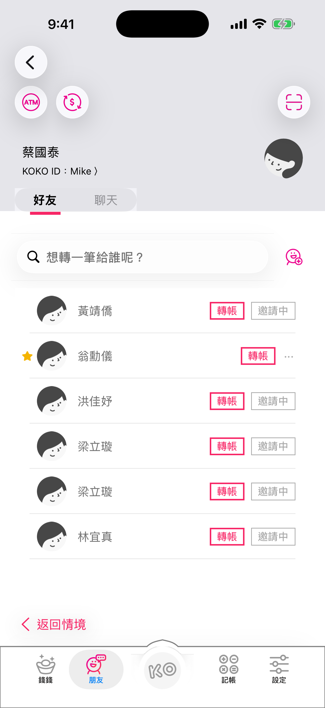
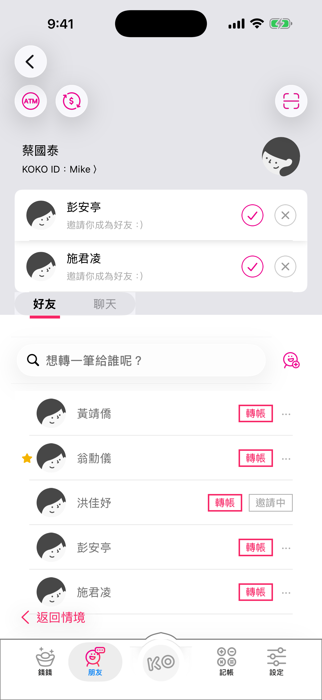

# KoKoComboFork

KoKoComboFork 是一個以 UIKit 實作的 KOKO 好友頁展示專案，提供不同好友狀態情境，展示好友清單、好友邀請、搜尋與空狀態畫面。

## Screenshots

<p>
  
  
  
  
</p>

## 專案簡介

這個 App 以 KOKO 好友頁為主軸，啟動後會先進入展示情境選擇頁，使用者可以切換不同資料狀態，快速查看好友頁在不同情境下的 UI 呈現。

目前支援三種展示情境：

- 無好友畫面
- 只有好友列表
- 好友列表含邀請

## 主要功能

- 展示情境選擇頁
- KOKO 好友主頁 UI
- 好友列表與空狀態切換
- 好友邀請列表顯示與收合
- 好友搜尋與即時篩選
- 下拉重新整理好友資料
- 自訂 Tab Bar 外觀
- 情境頁與主頁之間可返回切換，方便展示

## 技術內容

- Swift 5
- UIKit
- Storyboard / XIB
- MVVM 基本分層
- URLSession async/await API 請求
- 自訂 View、Button、Segmented Control、Tab Bar
- XCTest 單元測試

## Architecture

專案採用 UIKit + MVVM 的分層方向：

- `Controller`：負責 UIKit lifecycle、navigation、binding ViewModel output、套用畫面狀態
- `ViewModel`：負責資料請求、好友資料合併、搜尋篩選、cell display model、部分畫面狀態
- `Network`：封裝 API endpoint、request、response decode 與 service protocol
- `Model`：放置 API response 與 domain model
- `View`：放置 storyboard、xib、custom view 與 table view cell

目前 ViewModel 透過 `UserServicing` 注入資料服務，方便使用 mock service 撰寫單元測試。好友列表 cell 也改由 `FriendCellViewModel` 提供顯示資料，降低 cell 對 domain model 與上層 ViewModel 的耦合。

## 資料來源

專案使用公開 JSON 作為展示資料：

- `man.json`
- `friend1.json`
- `friend2.json`
- `friend3.json`
- `friend4.json`

API root endpoint：

```text
https://dimanyen.github.io/
```

## 專案結構

```text
KoKoComboFork/
├── Controller/
│   ├── Friend/
│   ├── Main/
│   ├── MainTabBarController/
│   └── Scenario/
├── Model/
├── Network/
├── View/
│   ├── Customised/
│   └── TableViewCell/
├── ViewModel/
├── Extension/
└── Assets.xcassets/
```

## 執行環境

- Xcode 16 或以上
- iOS 16.0 或以上
- Swift 5

## 如何執行

1. 開啟 `KoKoComboFork.xcodeproj`
2. 選擇 iOS Simulator
3. 執行 `KoKoComboFork` scheme

建議使用較新的 iPhone Simulator，例如：

```text
iPhone 17 Pro Max
```

> Signing 設定：專案的 `DEVELOPMENT_TEAM` 預設為空、bundle identifier 使用中性的 `com.example.*`，方便 clone 後直接在 Simulator 跑。如果要跑真機，請到 **Signing & Capabilities** 選擇自己的 Apple Developer team，並視需要改 bundle identifier。

## 測試

可以透過 Xcode Test，或使用指令執行：

```bash
xcodebuild test \
  -project KoKoComboFork.xcodeproj \
  -scheme KoKoComboFork \
  -destination 'platform=iOS Simulator,name=iPhone 17 Pro Max,OS=26.4.1'
```

目前測試涵蓋：

- 好友清單情境資料載入
- 好友資料合併邏輯
- 搜尋篩選邏輯

## 備註

此專案主要作為 UI 與資料狀態展示用途，並非完整金融服務 App。畫面、資料與操作流程皆以展示 KOKO 好友頁情境為主。

## Disclaimer

本專案為個人 iOS 開發練習作品，僅用於學習 UIKit / MVVM 分層與單元測試。

- 「KOKO」為國泰世華商業銀行旗下品牌，本專案與其官方並無任何關聯，也非該品牌之官方產品。
- 專案中的 UI 佈局、icon、配色僅為仿照原 App 介面進行 UI 練習，所有商標、品牌名稱與設計版權皆屬原權利人所有。
- 展示資料 (`man.json`、`friend1~4.json`) 來自公開的面試題測資 `https://dimanyen.github.io/`，並非真實使用者資料。
- 若任何權利人認為內容有侵權疑慮，請來信告知，我會立即下架對應內容。

## Privacy

本 App 不會蒐集任何個人資料、不接觸任何雲端服務、不整合任何分析 SDK，僅在執行期間讀取公開的展示用 JSON。完整說明請見 [PRIVACY.md](./PRIVACY.md)。

## License

本專案以 [MIT License](./LICENSE) 釋出。第三方相依與授權彙整請見 [THIRD_PARTY_LICENSES.md](./THIRD_PARTY_LICENSES.md)（目前無第三方相依）。
